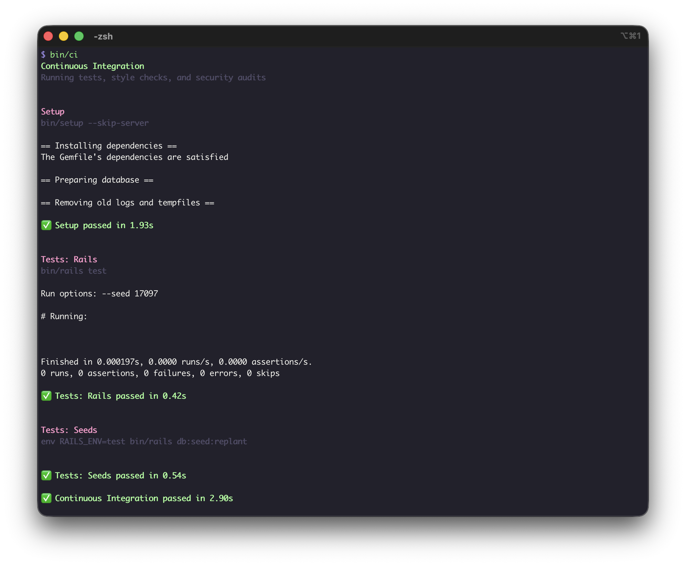

# Rails 8.1 demo app with CI that can be run locally

This is a demo app to show the Rails version 8.1 feature to configure and run the CI workflow locally.

- Rails blog post about v8.1 release: https://rubyonrails.org/2025/10/22/rails-8-1

## Setup the demo app

- Install the version of Ruby in the [`.ruby-version`](/.ruby-version) file.
- Clone the repo and install the libraries using `bundle install`

The Ruby on Rails gem version for this demo app is version 8.1, which can be seen in the [`Gemfile`](/Gemfile)

## Configuration for the CI

The file containing configuration for the CI can be found at:

- [`config/ci.rb`](/config/ci.rb)

## Run the CI locally

Using your terminal run the command:

```sh
bin/ci
```

Here is sample output from the CI terminal command:

```
$ bin/ci
Continuous Integration
Running tests, style checks, and security audits


Setup
bin/setup --skip-server

== Installing dependencies ==
The Gemfile's dependencies are satisfied

== Preparing database ==

== Removing old logs and tempfiles ==

✅ Setup passed in 1.45s


Tests: Rails
bin/rspec


Item
  validations
    is expected to validate that :name cannot be empty/falsy
    is expected to validate that :description cannot be empty/falsy
    is expected to validate that :price cannot be empty/falsy
    is expected to validate that :price looks like a number

Finished in 0.00676 seconds (files took 0.80785 seconds to load)
4 examples, 0 failures


✅ Tests: Rails passed in 0.92s


Tests: Seeds
env RAILS_ENV=test bin/rails db:seed:replant


✅ Tests: Seeds passed in 0.58s

✅ Continuous Integration passed in 2.95s
```

## Screenshots


